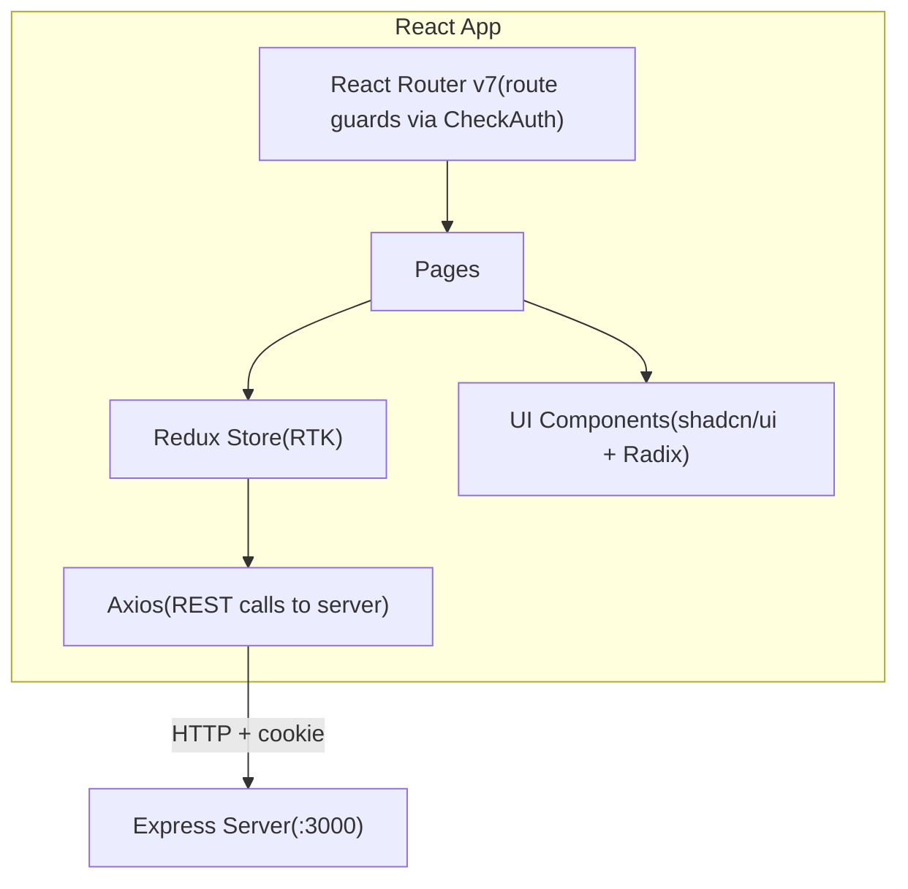
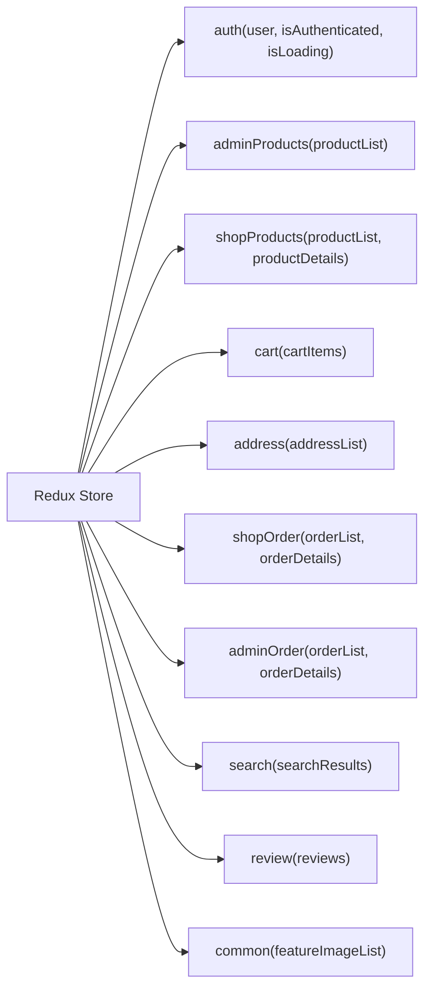
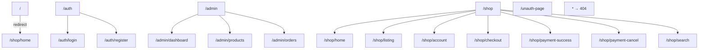

# E-Commerce Client

Frontend for the e-commerce platform, built with **React 19**, **Vite**, **Redux Toolkit**, and **Tailwind CSS v4**.

---

## Architecture



---

## State Management



---

## Route Structure



> All `/admin` and `/shop` routes are wrapped in `<CheckAuth>` which redirects unauthenticated users to `/auth/login` and non-admin users away from `/admin`.

---

## Getting Started

### Prerequisites

- Node.js >= 18
- The [e-commerce-server](https://github.com/Diptodas123/e-commerce-server) running on port `3000`

### Installation

```bash
npm install
```

### Environment Variables

Create a `.env` file in the root of `e-commerce-client/`:

```env
VITE_API_URL=http://localhost:3000
```

### Running the app

```bash
# Development
npm run dev

# Production build
npm run build

# Preview production build
npm run preview
```

The app will be available at **`http://localhost:5173`**.

---

## Project Structure

```
src/
├── assets/          # Static images (banners, brand logos)
├── components/
│   ├── admin-view/  # Admin layout, sidebar, product tile, image upload
│   ├── auth/        # Auth layout
│   ├── common/      # CheckAuth, Form, StarRating, LoadingScreen
│   ├── shopping-view/ # Product tile, cart, address, product details
│   └── ui/          # shadcn/ui primitives (Button, Sheet, Dialog…)
├── config/          # Form control definitions
├── hooks/           # useProductActions (shared cart/product logic)
├── lib/             # Tailwind utility (cn)
├── pages/
│   ├── admin-view/  # Dashboard, Products, Orders
│   ├── auth/        # Login, Register
│   ├── shopping-view/ # Home, Listing, Account, Checkout, Search…
│   └── not-found/
├── store/
│   ├── auth-slice/
│   ├── admin/       # products-slice, order-slice
│   ├── shop/        # products-slice, cart-slice, address-slice…
│   └── common/      # feature images slice
└── utils/           # cartUtils, convertToLocale, queryParams
```

---

## Tech Stack

| Layer | Library |
|---|---|
| Framework | React 19 |
| Build tool | Vite |
| Routing | React Router v7 |
| State management | Redux Toolkit + React-Redux |
| UI components | shadcn/ui (Radix UI primitives) |
| Styling | Tailwind CSS v4 |
| HTTP client | Axios |
| Icons | Lucide React |
| Toasts | Sonner |
| Payments | PayPal (redirect flow) |


The React Compiler is not enabled on this template because of its impact on dev & build performances. To add it, see [this documentation](https://react.dev/learn/react-compiler/installation).

## Expanding the ESLint configuration

If you are developing a production application, we recommend using TypeScript with type-aware lint rules enabled. Check out the [TS template](https://github.com/vitejs/vite/tree/main/packages/create-vite/template-react-ts) for information on how to integrate TypeScript and [`typescript-eslint`](https://typescript-eslint.io) in your project.
